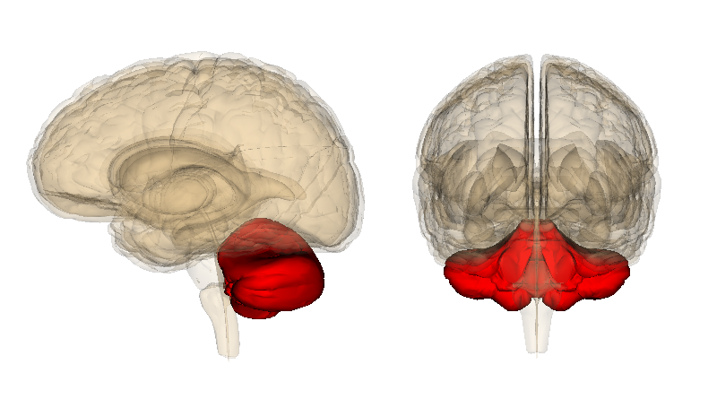
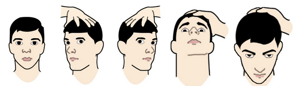
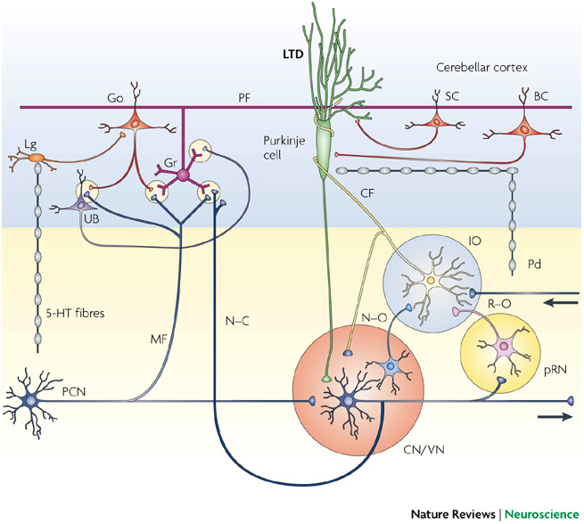
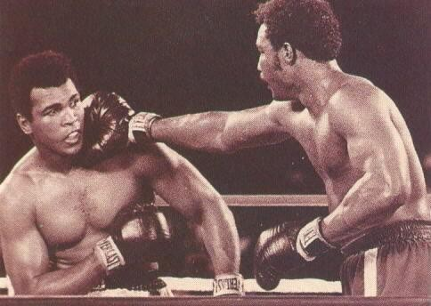
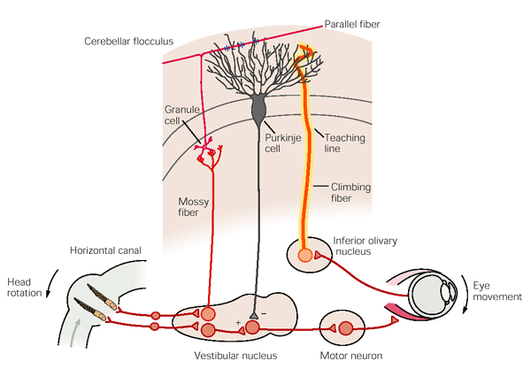
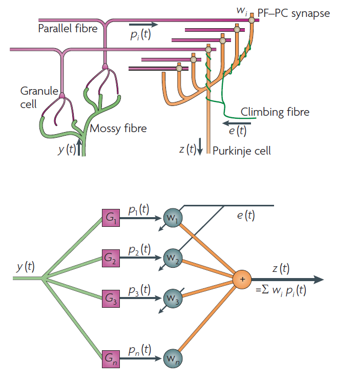
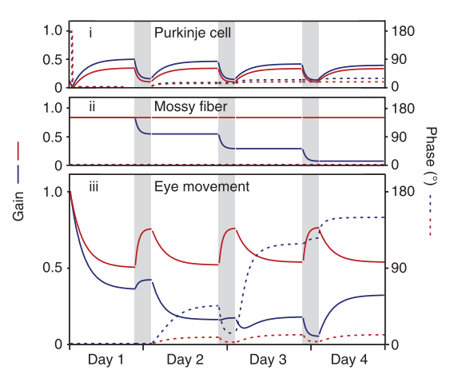

# Cerebellum

- Central role in motor learning
- Reflexes

^[http://bit.ly/18Th2bA]

# Cerebellar cortex

\begin{columns}[T]
\begin{column}[T]{5cm}
\includegraphics[height=3cm]{images/tmp15F112.jpg}
\end{column}
\begin{column}[T]{5cm} % each column can also be its own environment
\begin{itemize}
\item Uniform structure throughout the cerebellum
\item Composed of repeated modules or microzones
\item Same cell types and connectivity
\item Functional units
\item Different inputs, different targets
\item Cerebellar algorithm
\end{itemize}
\end{column}
\end{columns}

^[http://bit.ly/1CioLvp]

# Vestibulo-ocular reflex (VOR)

^[http://bit.ly/19GjJOA]

**Vestibulo-ocular reflex** (VOR) adaptation is one of the most studied cerebellar dependent motor learning tasks. It is used to provide insight about the connections and the coding of the circuitry of the cerebellum.

# Vestibulo-ocular reflex (VOR)

^[http://bit.ly/19GjJOA]

This reflex functions to **stabilize images** on the retinas during **head movement** by producing **eye movements** in the direction opposite to head movement, thus preserving the image on the center of the visual field.

# Flocculus

\begin{columns}[T]
\begin{column}[T]{5cm}
\includegraphics[height=3cm]{images/cerebellum.png}
\end{column}
\begin{column}[T]{5cm} % each column can also be its own environment
\begin{itemize}
\item Main cerebellar region that is responsible of the control of eye movements
\item Small lobe situated on the vestibulocerebellum
\item Optimize ocular motor performance
\item Image still enough on the fovea to interpret the scene in real time
\end{itemize}
\end{column}
\end{columns}

^[http://bit.ly/1CJEXGv]

# Problem statement

> Computational models of the vestibulo-ocular reflex don't take into account the role of the nucleo-olivary inhibition

^[http://bit.ly/1AVg1qX]

# Nucleo-olivary inhibition (NOI)

On the neuroanatomical circuitries and sites of cellular plasticity underlying adaptation of the vestibulo-ocular reflex there's a pathway that provides feedback for adjustment of the learning instruction.

It is formed by GABAergic neurons that innervate the neurons in the inferior olive from which the climbing fibres originate [@DeZeeuw2005]

* NOI __is not__ present on computational models of the VOR
* NOI __is__ present on __eye-blink__ reflex computational models

# Trade-offs in avoidance actions

# Extinction and NOI

- Cost-optimization
- Error-based learning
- Control the gain of the cerebellar output
- Acquired conditioned responses are extinguished once they become no longer necessary

[@Herreros2013b]

# Research question

What's the role of the nucleo-olivary inhibition in the vestibulo-ocular reflex?

## Fingerprints
- NOI has a role in the eye-blink reflex
- There is extinction of the adaptive response in the absence of peripheral error
- VOR has a non-perfect performance, with a residual error proportional to the amount of cerebellar action required

[@Herreros2013b]

# Hypothesis

Adding nucleo-olivary inhibition in the vestibulo-cerebellum explains extinction in the state of the art vestibulo-ocular reflex computational models.

# Computational models of the VOR

- Marr-Albus-Ito classical models
- The cerebellum as an adaptive filter
- Plasticity on the brainstem
- A detailed model

# Marr-Albus-Ito classical models

^[http://bit.ly/1ED2SEc]

[@Ito2006]

# Marr-Albus-Ito classical models

- Two very differents signals affect indirectly the output of the cerebellum
- Simple and complex spikes
- Plasticity at the parallel fibre to Purkinje cell synapses
- Climbing fibre (teaching signal or error): retinal slip
- Long-term depression (LTD)

# The cerebellum as an adaptive filter

[@Dean2010]

# The cerebellum as an adaptive filter

- Feed-forward system
- Motor error problem
- Decorrelation rule
- Minimizes correlations between eye movements as a predictor variable and retinal slip as a target variable
- Climbing fibre signal delayed, prevents perfect decorrelation

# Plasticity on the brainstem

- Plasticity in both cerebellar cortex and the brainstem
- Instructive signals in the climbing fibers are not necessary for cerebellum-dependent learning
- Instructive signals from climbing fibers or Purkinje cell simple spikes may be sufficient to induce motor learning

[@Ke2009a]

- Cortex-first
- Simple gain

[@Porrill2007]

# A detailed model

- Contribution of interneurons are added

- Plasticity on the cerebellar cortex
$$\dot{w}_{PG_i}(t) = [ \alpha_{PG}( \nu_{CF}-C(t)) +  \sqrt{ \alpha_{PG}}  \sigma  \xi (t)]G(t)$$

- Plasticity on the brainstem
$$\dot{w}_{VM}(t) = \alpha_{VM}(M_0-M(t))(P(t)-P_ini(t))$$

[@Clopath2014]

# Methods

- Implementation of the detailed model [@Clopath2014] of the VOR
- Reproduction of the results of the paper
- Add the NOI to the detailed model
- Simulation of adaptation, extinction and readaptation of the VOR

# Experimental setup

\begin{columns}[T] % contents are top vertically aligned
\begin{column}[T]{5cm} % alternative top-align that's better for graphics
\includegraphics[height=3cm]{images/vvor.png}
\end{column}
\begin{column}[T]{5cm} % each column can also be its own environment
\begin{itemize}
\item Day 0: Normal VOR
\item Day 1 and 2: VOR cancelation (gain decrease)
\item Day 3 and 4: Phase-reversal learning
\end{itemize}
\end{column}
\end{columns}

[@Wulff2009a]

# Reproduction of the results

[@Wulff2009a]

# Reproduction of the results

Evolution of the gain of the VOR on the different training sessions

[@Clopath2014]

\begin{columns}[T]
\begin{column}[T]{5cm}
\includegraphics[height=3cm]{images/report_03.png}
\end{column}
\begin{column}[T]{5cm}
\includegraphics[height=3cm]{images/report_06.png}
\end{column}
\end{columns}

# Adding the NOI to the detailed mode

Modulation in the dark of the teaching signal

- Modulated by vestibular information [@Clopath2014]
$$C(t) = \nu_{CF} - L(V(t- \delta) - V_t(t-\delta)) - H(M(t) - M_0)$$

- Modulated by cortical information
$$C(t) = \nu_{CF} - L(V(t- \delta) - V_t(t-\delta)) - H(kP(t))$$

# Preliminary results

Evolution of the gain of the VOR on the different training sessions (arbitrary *k*)

\begin{columns}[T]
\begin{column}[T]{5cm}
\includegraphics[height=3cm]{images/report_11.png}
\end{column}
\begin{column}[T]{5cm}
\includegraphics[height=3cm]{images/report_14.png}
\end{column}
\end{columns}

# Project planning

- 10/2014 to 02/2015: State of the art review
- 10/2014 to 11/2014: Implement Clopath's minimal model
- 11/2014 to 12/2014: Implement Clopath's detailed model
- 12/2014 to 02/2015: Reproducing experimental results
- 02/2015 to 03/2015: Add NOI to the model
- 03/2015 to 04/2015: Validating the model
- 04/2015 to 05/2015: Analyze results
- 03/2015 to 06/2015: Writing the report

# Where we are now

- Detailed model [@Clopath2014] implemented in Matlab
- Results reproduced as on the article
- NOI added to the model

# Future work

* Analyze detailed model assumptions
    + What are the effects of clipping weights on the PF-PC synapses?
    + Identify other assumptions of the detailed model
* Comparing detailed and NOI models
    + Do they show linear or exponential decay after one week light deprivation?
    + What does maintaining the training to the cortex-nuclei memory balance?

# References