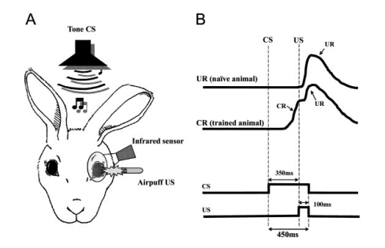

# Trade-offs in avoidance actions

^[http://bit.ly/1OyIoEI]

# Optimization of aversive reflexes

- Avoid aversive stimuli with minimum necessary effort
- How we behave carries a cost: What we fail to prevent + preventing action itself
- The ideal actions are those that minimize the overall cost

[@Brandi2014a]

# Nucleo-olivary inhibition (NOI)

\begin{columns}[T]
\begin{column}[T]{5cm}
\includegraphics[]{images/nrn2332-f3.jpg}
\end{column}
\begin{column}[T]{5cm} % each column can also be its own environment
\begin{itemize}
\item Cost-optimization
\item Error-based learning
\item Acquired conditioned responses are extinguished once they become no longer necessary
\item The gain of the NOI is what determines the amplitude of the response on adaptive reflexes
\end{itemize}
\end{column}
\end{columns}

^[http://bit.ly/1AVg1qX]

[@Herreros2013b]

# Eye-blink reflex conditioning

^[http://bit.ly/1CXvsoK]

# NOI on eye-blink reflex

- Perceiving an air-puff in the unprotected cornea has a cost
- Two types of costs
    - Failing to avoid: error-based learning
    - Avoiding when not necessary
- Extinction of unnecessary conditioned responses

[@Herreros2013b]

# Vestibulo-ocular reflex (VOR)

^[http://bit.ly/19GjJOA]

This reflex functions to **stabilize images** on the retinas during **head movement** by producing **eye movements** in the direction opposite to head movement, thus preserving the image on the center of the visual field.

# Vestibulo-ocular reflex (VOR) adaptation

\begin{columns}[T]
\begin{column}[T]{5cm}
\includegraphics[]{images/13.jpg}
\end{column}
\begin{column}[T]{5cm} % each column can also be its own environment
\begin{itemize}
\item VOR adaptation is one of the most studied cerebellar dependent motor learning tasks
\item It is used to provide insight about the connections and the coding of the circuitry of the cerebellum
\end{itemize}
\end{column}
\end{columns}

^[http://bit.ly/1Ox3Qd6]

# Problem statement

> Computational models of the vestibulo-ocular reflex don't take into account the role of the nucleo-olivary inhibition

# Research question

> What's the role of the nucleo-olivary inhibition in the vestibulo-ocular reflex?

## Fingerprints
- NOI has a role in the eye-blink reflex
- There is extinction of the adaptive response in the absence of peripheral error
- VOR adaptation has a non-perfect performance, with a residual error proportional to the amount of cerebellar action required

[@Herreros2013b]

# Hypothesis

> Adding nucleo-olivary inhibition on a detailed bottom-up state of the art vestibulo-ocular reflex computational model would offer a more parsimonious explanation of the experimental behavior of the reflex.

# Computational models of the VOR

Models of the cerebellar microcircuit

- Marr-Albus-Ito classical models
- Plasticity on the brainstem
- A detailed bottom-up model

# Cerebellar cortex

\begin{columns}[T]
\begin{column}[T]{5cm}
\includegraphics[height=3cm]{images/tmp15F112.jpg}
\end{column}
\begin{column}[T]{5cm} % each column can also be its own environment
\begin{itemize}
\item Uniform structure throughout the cerebellum
\item Composed of repeated modules or microzones
\item Same cell types and connectivity
\item Functional units
\item Different inputs, different targets
\item Cerebellar algorithm
\end{itemize}
\end{column}
\end{columns}

^[http://bit.ly/1CioLvp]

# Marr-Albus-Ito classical models

^[http://bit.ly/1ED2SEc]

[@Ito2006]

# Plasticity on the brainstem

- Plasticity in both cerebellar cortex and the brainstem
- Cerebellar cortex for quick adaptation
- Brainstem as long-term memory
- Brainstem learns a simple gain

[@Ke2009a]

# A detailed bottom-up model

This computational model is made bottom-up from physiological and behavioral observations.

- Plasticity on the cerebellar cortex
- Plasticity on the brainstem
- Delayed error signal
- White noise on the signals
- Contribution of interneurons

[@Clopath2014]

# Methods

- Implementation of the detailed model [@Clopath2014] of the VOR
- Reproduction of the results of the paper
- Add the NOI to the detailed model
- Simulation of adaptation, extinction and readaptation of the VOR

# Experimental setup

\begin{columns}[T] % contents are top vertically aligned
\begin{column}[T]{5cm} % alternative top-align that's better for graphics
\includegraphics[height=3cm]{images/vvor.png}
\end{column}
\begin{column}[T]{5cm} % each column can also be its own environment
\begin{itemize}
\item Day 0: Normal VOR
\item Day 1 and 2: VOR cancellation (gain decrease)
\item Day 3 and 4: Phase-reversal learning
\end{itemize}
\end{column}
\end{columns}

[@Wulff2009a]

# Reproduction of the results

[@Wulff2009a]

# Reproduction of the results

Evolution of the gain of the VOR on the different training sessions

[@Clopath2014]

\begin{columns}[T]
\begin{column}[T]{5cm}
\includegraphics[height=3cm]{images/report_03.png}
\end{column}
\begin{column}[T]{5cm}
\includegraphics[height=3cm]{images/report_06.png}
\end{column}
\end{columns}

# Adding the NOI to the detailed mode

Modulation in the dark of the teaching signal

- Modulated by vestibular information [@Clopath2014]
$$C(t) = \nu_{CF} - L(V(t- \delta) - V_t(t-\delta)) - H(M(t) - M_0)$$

- Modulated by cortical information
$$C(t) = \nu_{CF} - L(V(t- \delta) - V_t(t-\delta)) - H(kP(t))$$

# Preliminary results

Evolution of the gain of the VOR on the different training sessions (arbitrary *k*)

\begin{columns}[T]
\begin{column}[T]{5cm}
\includegraphics[height=3cm]{images/report_11.png}
\end{column}
\begin{column}[T]{5cm}
\includegraphics[height=3cm]{images/report_14.png}
\end{column}
\end{columns}

# Project planning

- 10/2014 to 02/2015: State of the art review
- 10/2014 to 11/2014: Implement Clopath's minimal model
- 11/2014 to 12/2014: Implement Clopath's detailed model
- 12/2014 to 02/2015: Reproducing experimental results
- 02/2015 to 03/2015: Add NOI to the model
- 03/2015 to 04/2015: Validating the model
- 04/2015 to 05/2015: Analyze results
- 03/2015 to 06/2015: Writing the report

# Future work

* Analyze detailed model assumptions
    + What are the effects of clipping weights on the PF-PC synapses?
    + Identify other assumptions of the detailed model
* Comparing detailed and NOI models
    + Do they show linear or exponential decay after one week light deprivation?
    + What does maintaining the training to the cortex-nuclei memory balance?

# References

\fontsize{6}{10}
\selectfont