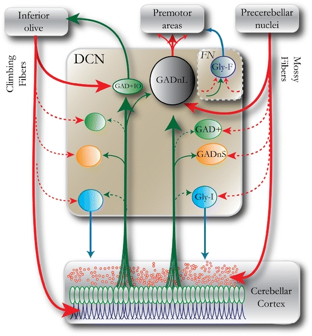
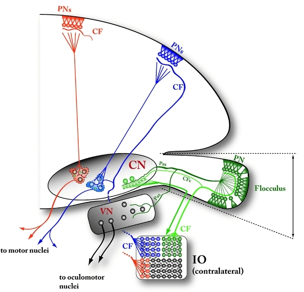

\fontsize{12}{22}
\selectfont

# Integration of Purkinje Cell Inhibition by Cerebellar Nucleo-Olivary Neurons [@Najac2015]

Neurons in the cerebellar cortex, cerebellar nuclei, and inferior olive (IO) form a trisynaptic loop critical for motor learning.

Understanding how nucleo-olivary cells convert synaptic inputs into spike outputs has been impeded by difficulty in identifying nucleo-olivary cells.

Nucleo-olivary cells can therefore integrate and report the recent history of Purkinje cell activity, which may be suited to their role in motor learning.

Evidence from behavioral, anatomical, and pharmacological studies demonstrates that nucleo-olivary cells regulate associative learning by regulating spiking by IO cells, which transmit error signals from unconditioned stimuli to the cerebellar cortex.

Keywords: cerebellum, deep cerebellar nuclei, inferior olive, nucleo-olivary cells

\pagebreak

# Integrated plasticity at inhibitory and excitatory synapses in the cerebellar circuit [@Mapelli2015]

In the cerebellum, long-term synaptic plasticity was initially predicted on theoretical grounds to occur only in the form of LTD or LTP (Marr, 1969; Albus, 1971) at the parallel fiber—Purkinje cell (PF-PC) synapse, but now synaptic plasticity is known to be distributed in the granular layer, molecular layer and deep cerebellar nuclear (DCN; Hansel et al., 2001; Gao et al., 2012) involving both excitatory and inhibitory synaptic transmission as well as neuronal intrinsic excitability.

Recent works (Medina and Mauk, 1999, 2000; Masuda and Amari, 2008) have suggested the importance for MF-DCN and PC-DCN plasticity in controlling cerebellar learning in eye-blink conditioning and vestibulo-ocular reflex.

The critical role in executing precise movements becomes evident when studying patients with cerebellar malfunctioning and diseases, who manifest a sensori-motor syndrome called ataxia.

It is likely that the cerebro-cerebellar loops involved in motor control represent also a model of how the cerebellum takes part in higher functions through reciprocal connections with non-motor brain areas.

The ability to elaborate temporal information on the millisecond time scale led to consider the cerebellum as a timing machine (Eccles et al., 1967; Eccles, 1973; Ivry, 1997). As a site of procedural memory, the cerebellum has been predicted to operate as a learning machine (Marr, 1969; Ito, 2006). It receives the motor commands from cerebral cortex and, through internal memory of movement inverse dynamics, it is able to elaborate a prediction
of sensory consequences of motor acts. The sensory prediction is then compared to the sensory feedback to produce a sensory discrepancy signal (Blakemore et al., 2001; Ivry et al., 2002; Ivry and Spencer, 2004). This triad—namely learning, timing and prediction—emerges as a crucial determinant in adaptive behavior under cerebellar control (De Zeeuw et al., 2011; D’Angelo and Casali, 2012).

While the PCs represent the only output of the cerebellar cortex, the DCN neurons integrate the PC inhibitory input with the excitatory inputs carried by CFs and MFs collaterals and provide the sole output of the cerebellum.

The regular architecture of the cerebellum has inspired several theories, aiming at understanding how the cerebellum processes incoming information and performs timing and learning functions. According to the motor-learning theory (Marr, 1969; Albus, 1971), the property of learning motor skills relies on the cerebellar cortex ability to store stimulus-response associations, by linking inputs with the appropriate motor output. The theory implied that only PF-PC synapses may be modified by experience and that the CF acting as a teacher signal calibrates the PC responsiveness and thus leads the encoding of stimulus-responses associations. The motor-learning theory in the Marr’s version implies that, when MFs carry inappropriate information, the PF-PC synapse should be silenced by the olivary input (the opposite would occur according to Albus’ version).

Miles and Lisberger proposed an alternative model (valid at least for theVOR), in which motor learning is achieved through synaptic plasticity at a different site. The instructive signal conveyed by the PC to the vestibular nuclei triggers a change in synaptic efficacy in the connection between MF collaterals and vestibular nuclei (Miles and Lisberger, 1981).

Experimental data provided support for and against each of the two hypotheses, indicating that the explanation of cerebellar motor learning is likely to involve a more complex picture than plasticity at a single synapse.

It is likely that cerebellar learning emerges as an integrated process involving various synaptic sites that elaborate, over different time courses, different components of learning.

Mathematical models (Mauk and Donegan, 1997; Medina and Mauk, 1999, 2000; Medina et al., 2000, 2001; Ohyama et al., 2003b; Mauk and Buonomano, 2004; Lepora et al., 2010) incorporating more and more details on synaptic connectivity and plasticity at different network sites, may help determining the impact of the different sites of plasticity on cerebellar learning (Shadmehr et al., 2010). These computational approaches have generated several hypotheses, many of which require validation through experimental assessment.

The Marr-Albus-Ito hypothesis of cerebellar motor learning implies that the PF input to PCs is the only site of learning in the cerebellar network. However, multiple sites of synaptic plasticity in the molecular layer have been described (Hansel et al., 2001; Boyden et al., 2004; Coesmans et al., 2004; Ito, 2006). The picture emerging from the latest evidences shows that several forms of synaptic plasticity, not only the classical PF-PCs LTD, appear to be involved in cerebellar learning.

The DCN (as well as the vestibular nuclei, VN) are strategically located within the cerebellar circuitry, in a position ideal to integrate the information coming from brain stem, inferior olive (IO) and spinal cord with the PCs output coming from the cerebellar cortical loop, and provide the sole output of the cerebellum.

DCN play an important role in associative learning, such as in eyelid conditioning or VOR adaptation (Lavond et al., 1985; Steinmetz et al., 1992). Evidence that these forms of cerebellar motor learning induce plasticity in DCN and VN (Lisberger, 1994; du Lac et al., 1995; Kleim et al., 2002; Ohyama et al., 2006) suggested that memory storage was not limited to the cerebellar cortex.

Recently, it has been suggested that PC-DCN and MF-DCN synapses are plastic on a slow time scale and store persistent memory. Conversely, plasticity in cerebellar cortex could operate on a shorter time scale, storing transient memory that could then be transferred downstream and consolidated through DCN plasticity in slow phases of learning (Medina and Mauk, 1999; Medina et al., 2000; Masuda and Amari, 2008).

The PCs respond to the unconditioned stimulus with a complex spike, followed by a brief pause that allows the post-inhibitory firing in the nuclei. During cerebellar learning of associative tasks, the acquisition of the conditioned response depends on the correct timing between the MF-mediated excitation and the PC-mediated inhibition that drives excitatory post-synaptic currents (EPSCs) potentiation (Ohyama et al., 2003a). The PCs fire as a response to MF activation, but when the conditioned and unconditioned stimuli are paired and repeated, PCs firing slows down during the final phase of the conditioned stimulus.

In each subcircuit, inhibitory interneurons fine-tune the principal neuron output and the critical issue is whether inhibitory plasticity tends to compensate and rebalance changes (homeostatic effect) or rather reinforces and amplifies the effects of excitatory plasticity occurring in the main neuronal pathway (synergistic effect).

The whole cerebellar cortex acts as a third large feed-forward inhibitory loop controlling retransmission through the DCN.

Cerebellar modeling has traditionally focused on the classical Marr-Albus’ hypothesis of cerebellar learning (Marr, 1969; Albus, 1971), accounting for plasticity only at the PF-PC connection. According to the Marr-Albus’ hypothesis, the cerebellum operates like a perceptron (Albus, 1971). The PF-PC synapses adapt their weights depending on CF activity (assumed to carry error-related signals) and GrC activity (assumed to perform expansion recoding of sensory inputs reaching the cerebellum through the MFs). Although the Marr-Albus’ hypothesis does not account for the numerous forms of cerebellar plasticity and totally ignored any potential role for inhibitory plasticity, it has inspired most cerebellar models elaborated so far. Surprisingly, in these models based on the Marr-Albus’ hypothesis, the cerebellum succeeded in solving different kinds of tasks, including eyelid conditioning (Medina
and Mauk, 2000), VOR adaptation (Masuda and Amari, 2008) and object manipulation (Luque et al., 2011) or even multiple tasks together demonstrating generalization (Casellato et al., 2014). The fact is that learning in these tasks was oversimplified and far from biological realism, so that these models provided a proof of principle that the cerebellum requires plasticity to perform sensory-motor control rather than explaining how its internal plasticity mechanisms operate.

Other models have long hypothesized the role of plasticity in DCN afferent synapses (Medina et al., 2001; Masuda and Amari, 2008; Garrido et al., 2013a; Clopath et al., 2014). These models generally agree that MF-DCN plasticity consolidates the information that has previously been acquired due to
the molecular layer plasticity. The separation of learning in two stages (fast learning and consolidation) has been shown to enhance the learning capabilities in eyeblink conditioning (Medina et al., 2001; Monaco et al., 2014), VOR (Masuda and Amari, 2008; Clopath et al., 2014) and complex manipulation tasks (Garrido et al., 2013a).

Finally, closed-loop robotic simulations are needed to determine the effective engagement of network learning mechanisms during complex tasks. In this framework, the cerebellar network is likely to provide a very effective workbench.

Keywords: cerebellum, inhibitory synapse, excitatory synapse, LTP, LTD, distributed plasticity, computational models

\pagebreak

# Differential GABAergic and Glycinergic Inputs of Inhibitory Interneurons and Purkinje Cells to Principal Cells of the Cerebellar Nuclei [@Husson2014]

The principal neurons of the cerebellar nuclei (CN), the sole output of the olivo-cerebellar system, receive a massive inhibitory input from Purkinje cells (PCs) of the cerebellar cortex. Morphological evidence suggests that CN principal cells are also contacted by inhibitory interneurons, but the properties of this connection are unknown. Using transgenic, tracing, and immunohistochemical approaches in mice, we show that CN interneurons form a large heterogeneous population with GABA/glycinergic phenotypes, distinct from GABAergic olive-projecting neurons.

The cerebellar nuclei (CN) form the sole output of the cerebellar system integrating direct pathways and indirect pathways via the cerebellar cortex. Important components of cerebellar plasticity (Zheng and Raman, 2010) and sensorimotor learning (Miles and Lisberger, 1981; Medina et al., 2000) are implemented in the CN rather than in the cerebellar cortex, although the latter was more extensively studied. Hence, understanding information processing in the CN, including how local connectivity controls the activity of CN principal cells (Uusisaari and Knopfel, 2012) is a central endeavor for cerebellar studies.

Keywords: NOI, PC-DCN, GABAergic neurons

\pagebreak

# Changes in complex spike activity during classical conditioning [@Rasmussen2014]

Consistent with earlier reports, the evidence presented in this paper shows that the IO is suppressed following the emission of a CR. In addition, the evidence shows that this suppression is a consequence of training. This observation, together with the correspondence between the time course of the Purkinje cell CR and the complex spike suppression, supports the view that the suppression of the IO is caused by Purkinje cell CRs disinhibiting the CN and activating the N-O pathway.

Although Purkinje cell activity, as well as stimulation of the CN, is known to influence IO activity, much remains to be learned about the way that learned changes in simple spike firing affects the IO.

In agreement with the N-O feedback hypothesis, acquisition resulted in a gradual decrease in complex spike activity during the conditioned stimulus, with a delay that is consistent with the long N-O latency.

The evidence also suggests that the N-O fibers form a closed loop, that is, they target those olivary cells that are part of the same microcomplex (Apps and Garwicz, 2005).

In accordance with the view that the climbing fibers from the IO transmit teaching signals to the cerebellum, such as the US in classical conditioning, an output signal from the CN to the motor system would be accompanied by an inhibitory signal to the IO to suppress the teaching command and further learning.

How does the learned Purkinje cell CR compare to N-O stimulation in its ability to influence IO activity? Is the delay between the Purkinje cell CR and the IO inhibition consistent with the long delay in the N-O pathway (Hesslow, 1986; Svensson et al., 2006)? Does IO activity increase during extinction, when the Purkinje cell CR disappears? Does reduced simple spike firing in a Purkinje cell cause inhibition of IO neurons projecting to that same Purkinje cell?

IO is suppressed following the emission of a CR. In addition, the evidence shows that this suppression is a consequence of training. This observation, together with the correspondence between the time course of the Purkinje cell CR and the complex spike suppression, supports the view that the suppression of the IO is caused by Purkinje cell CRs disinhibiting the CN and activating the N-O pathway.

Keywords: IO, NOI, PC-DCN

\pagebreak

# Clusters of cerebellar Purkinje cells control their afferent climbing fiber discharge [@Chaumont2013]

Purkinje cells target the deep cerebellar nuclei, which are the output of the cerebellum and include an inhibitory GABAergic projection to the inferior olive. Therefore, sets of Purkinje cells may phasically control their own climbing fiber afferents.

Therefore, the discharge of a population of PCs in a microzone might not only shape the output of the cerebellum but also control its afferent climbing-fiber signal. Previous studies have shown that stimulation of the nucleo-olivary pathway significantly reduces olivary cell firing (16–18) and that pharmacological and genetic manipulations of PCs or olivary cell activity induce reciprocal modulations of the firing rate of PCs and climbing fibers (19, 20). These results indicate that PCs may tonically modulate the nucleo-olivary pathway. However, whether the cerebellar cortex can phasically recruit this pathway and whether this circuit functions as a closed loop is currently unknown.

We show that stimulating a set of PCs in a region of the cerebellar cortex triggers a restricted inhibition in the cerebellar nuclei and a transient disinhibition of the inferior olive cells that project to this set of PCs.

These results indicate that PCs may tonically modulate the nucleo-olivary pathway. However, whether the cerebellar cortex can phasically recruit this pathway and whether this circuit functions as a closed loop is currently unknown.

These findings identify a functional closed-loop organization in the olivo-cerebellar circuits that is potentially important for cerebellar motor learning.

A wide range of theoretical and experimental evidence has led to the proposal that learning mechanisms in the cerebellar cortex underlie the formation and the storage of internal models of the sensory-motor system (46). These models convert desired movements into motor commands or predict sensory outcomes of planned movements (47); the adjustment of the models is performed by supervised learning via the climbing fibers. The cortico-nucleo-olivary pathway described in our study provides a way to propagate the predictions computed in the cerebellar cortex to the inferior olive, where it can be compared, with an appropriate delay, with the actual outcome of the ongoing task carried by other inputs to the inferior olive. Therefore, the closed cortico-nucleo-olivary loops may play an essential role in adjusting the internal models in the cerebellum.

Keywords: NOI, PC-DCN, OCNO loop, internal models, GABAergic neurons

\pagebreak

# The mysterious microcircuitry of the cerebellar nuclei [@Uusisaari2011a]

Activity in Purkinje neurons, either as single cells or populations, does not directly mediate the cerebellar effects on the motor effector systems.Rather, the result of the entire cerebellar cortical computation is passed to the relatively small cerebellar nuclei that act as the final, integrative processing unit in the cerebellar circuitry.

It is striking that the internal organization and the connectivity with afferent and efferent pathways in the cerebellar nuclei are rather poorly known.

All these issues are important for predicting the pattern-extraction and encoding capabilities of the cerebellar nuclei and, until resolved, theories and models of cerebellar motor control and learning may err considerably.

The role played by the olivo-cerebellar system in motor control has been the subject of intensive research; it is thought to be involved in motor learning (Kawato, 1999; Ohyama et al. 2003) and/or in the timing of motor execution.

Observation that the afferent fibres (‘climbing fibres’, CFs) from the inferior olive (IO) are organized in strictly parasagittal bands in the cerebellar cortex, so that nearby neurons in the IO target Purkinje neurons (PNs) localized in narrow, rostrocaudal bands. This organization is complemented by another topographically arranged afferent input, the mossy fibre (MF)–parallel fibre (PF) pathway. Together, the CF and MF–PF pathways are thought to subdivide the otherwise quite homogeneous cerebellar cortex into numerous areas (sometimes called ‘zones’ or ‘patches’; Apps & Hawkes, 2009), each dedicated to processing signals originating from a certain body area or sensory modality.

The anatomical organization combined with physiological and behavioural studies have given rise to several models of the cerebellar role in motor learning, the most widely believed of which defines the input arriving on climbing fibres as ‘error’ or ‘teacher’ signals that lead to depression of the parallel fibre–PN synapses and to reduced PN output (Ito, 2001).

The effects of plasticity are more subtle (Steuber et al. 2007) and that many more modes and loci of plasticity are involved in learning (Hansel et al. 2001; Jörntell &Hansel, 2006).

Regardless of the debate on how the cerebellar cortex contributes to motor learning, it is clear that the signals must be finally integrated in the PNs as they are its only output. The result of cerebellar computation – encoded in a still-debated manner in the sequence of simple and complex spikes (Welsh, 2002; Jacobson et al. 2008; De Schutter & Steuber, 2009) – is conveyed by the GABAergic PN axons mainly to cerebellar nuclei (CN) neurons via projections roughly following the anatomical organization of the cerebellar cortex. A supposedly analogous but weaker connection from the floccular cerebellum also targets the vestibular nuclei (VN) and contributes to the vestibulo-ocular reflex.

A cornerstone of many theories of cerebellar function is a strictly conserved topographical organization of the olivo-cortico-nucleo-olivary (OCNO) pathway, an idea which is supported by the remarkably neat arrangement especially between the floccular PN, the flocculus-related areas in the inferior olive (ventrolateral outgrowth, and dorsal cap of Kooy) and GABAergic nucleo-olivary (NO) neurons in the ventral part of lateral CN (De Zeeuw et al. 1994 (rabbit); Teune et al. 1998 (rat); Schonewille et al. 2006 (mouse)). Specifically, NO neurons are known to project to IO areas that provide CFs for PNs targeting the sameNOneurons (Fig. 3Aa). This inhibitory nucleo-olivary pathway is proposed to suppress CF input from the IO to the related area in the cerebellar cortex (Ruigrok & Voogd, 1990, 2000; Bengtsson & Hesslow, 2006; Marshall & Lang, 2009) when a correct response to a mossy fibre (MF) activity pattern is learned either in the cerebellar cortex or within the CN (McCormick & Thompson, 1984; Kimet al. 1998; Kenyon et al. 1998; Bao et al. 2002; Ito, 2006). Despite its appeal, this picture is certainly oversimplified, as NO neurons in certain subregions of the CN are known to project to both contra- and ipsilateral IO (Ruigrok & Voogd, 1990; Teune et al. 2000), thereby breaking the strict reciprocity of the nucleo-olivary connections as the olivo-nuclear axons are entirely contralateral (Ruigrok & Voogd, 1990).

Keywords: PC, OCNO loop, DCN, GABAergic neurons

\pagebreak

## The anatomy of the OCNO loop.

A critical question in assessing this theory is, whether the OCNO loop is equally well conserved over all of the cerebellum (Fig. 3B). In otherwords, do all NO neurons receive cortical inhibition exclusively from PNs driven by IO neurons that the same NO neurons target or do they integrate converging input from a wider range of PNs? Conversely, do all cerebellar cortical areas control NO neurons equally or are some of them specialized for this function?

This area contains a higher density of NO neurons (Chan-Palay, 1973c; Giaquinta et al. 1999), and the arrangement of the PN axons that target this ventrolateral CN area differs from those terminating in medial and dorsal CN in terms of terminal spread (Chan-Palay, 1977; Sugihara, 2010) aswell as by their extension into the VN (Fig. 3B;DeZeeuw et al. 1994; Teune et al. 2000; Schonewille et al. 2006; Voogd & Barmack, 2006; Bagnall et al. 2007; Sugihara et al. 2009). Even though the VN are often thought to be ‘analogous’ to the CN, the VN neurons targeted by PNs do not inhibit the IO (Sekirnjak et al. 2003), clearly placing them outside of the OCNO loops.

The floccular cerebellum (FC; far right) and the related behavioural function (vestibulo-ocular reflex) have been the focus of intense study, and features described in this system (such as conservation of OCNO pathway on a single-cell level) have been thought to generalize to the entire cerebellum. However, the connections of the vestibulocerebellum (incorporating the floccular cerebellar cortex, the ventralmost part of the lateral CN, and specific regions of the contralateral IO, the ventrolateral olive and dorsal cap of Kooy) to the CN exhibit many structural differences compared to those from the cerebellar hemispheres. Most strikingly, the olivo-nuclear CF collaterals and PN axons in the FC target an area in the CN that has significantly fewer large glutamatergic projection neurons than the rest of the CN, and part of the FC signalling to its extracerebellar targets (the oculomotor nuclei) is conveyed via the projection neurons within the vestibular nuclei (VN) that are outside the OCNO loop.

In addition to being modulated by the inhibitory PN synapses, the firing of NO neurons is also likely to be modulated by the excitatory and at least partly reciprocally arranged olivary climbing fibre collaterals (Fig. 3) (De Zeeuw et al. 1997). This pathway may form a negative feedback loop for synchronous IO activity. However, since nothing is known of the physiology of the olivo-nuclear pathway – synaptic responses to IO stimulation in NO neurons have not even been shown – this proposal remains speculative.

Thus, even though the CF collateral innervation in CN has been generally considered as ‘sparse’ (as compared with other afferent pathways; Chan-Palay, 1977), the CF collateral feedback may have a stronger role in cerebellar computations related to vestibulo-ocular functions.

The extent of possible complementary MF collateral innervation of NO neurons is presently unclear. The terminal targets of MFs in both cerebellar cortex and CN seem to be roughly linked to the topographically conserved corticonuclear projection (Shinoda et al. 2000), and thus convergence of cortical and nuclear MF pathways on single NO neurons would be anatomically possible. Currently the existence of MF collateral synapses on NO neurons remains to be demonstrated.

Considering the full cerebellum, it is striking that the entire output of its vast cortex with numerous input-specific patches is funnelled through a very small number of CN projection neurons.

Keywords: OCNO loop, VN, CN, PN, IO

\pagebreak

# Reevaluating the Role of LTD in Cerebellar Motor Learning [@Schonewille2011]

Long-term depression at parallel fiber-Purkinje cell synapses (PF-PC LTD) has been proposed to be required for cerebellar motor learning. These findings demonstrate that PF-PC LTD is not essential for cerebellar motor learning.

Against our expectations, we did not find any deficit in various forms of cerebellar motor learning when we tested three different types of mutant mice that lack expression of cerebellar LTD. Together, these data argue against an essential role for LTD in cerebellar motor learning. Still, despite the absence of a compensatory change in PF-PC LTP induction or presynaptic PF plasticity, we cannot exclude the development of other compensatory mechanisms that might contribute to cerebellar motor learning in the three types of LTD-expression-deficient mutants tested here.

However, the potential occurrence of compensatory mechanisms does not undermine the conclusion that the data presented here challenge the classical Marr-Albus-Ito hypothesis, because the ability to adjust the PF input to PCs was proposed to be the fundamental and essential requirement for motor learning (Albus, 1971; Marr, 1969). Our data demonstrate that motor learning can occur completely normally in the absence of PF-PC LTD, or at least in the absence of the form of PF-PC LTD that has been investigated intensely with a wide range of stimulus protocols over the past decades (Ito, 1982; Linden and Connor, 1995;DeZeeuw et al., 1998; Hansel et al., 2006).

Keywords: OKR, VOR increase, visual VOR (VVOR), training paradigms, PF-PC LTD

\pagebreak

# Neural Circuits of the Cerebellum: Hypothesis for Function [@DAngelo2011]

Important review

Keywords:

\pagebreak

# Multiple types of cerebellar target neurons and their circuitry in the vestibulo-ocular reflex [@Shin2011]

In contrast with the rich information available about the organization of the cerebellar cortex and its synaptic inputs, relatively little is known about microcircuitry postsynaptic to Purkinje cells. Here we examined the cell types and microcircuits through which Purkinje cells influence an oculomotor behavior controlled by the cerebellum, the horizontal vestibulo-ocular reflex, which involves only two eye muscles. Using a combination of anatomical tracing and electrophysiological recordings in transgenic mouse lines, we identified several classes of neurons in the medial vestibular nucleus that receive Purkinje cell synapses from the cerebellar flocculus.

Purkinje cell activity influences the neural control of eye movements in several distinct ways. These results indicate that the cerebellum regulates a simple reflex behavior via at least five different cell types that are postsynaptic to Purkinje cells.

One of the simplest behaviors regulated by the cerebellum is the vestibulo-ocular reflex (VOR), which in the horizontal plane is controlled by only two extraocular muscles. The VOR functions to stabilize images on the retina during self-motion; its excellent performance throughout life is maintained by robust, experience-dependent learning, which relies on the cerebellum (Marr, 1969; Albus, 1971; Ito, 1972;DeZeeuwet al., 1998; Shutoh et al., 2003; for review, see De Zeeuw and Yeo, 2005; Highstein and Holstein, 2006).

Robust motor learning, together with tractable circuitry interposed between the cerebellum and motor neurons, makes the VOR an excellent model for investigating the microcircuitry by which the cerebellum influences behavior.

This study demonstrates that the cerebellum influences a simple cinergic and glutamatergic neurons, respectively, and that sensory-motor behavior via at least five different cell types inner-these neurons receive dense somatic and dendritic Purkinje cell vated by Purkinje cells.

Our results indicate that in addition to an unmodifiable pathway, the VOR circuit comprises several microcircuits that may be differentially modified by the cerebellum.

Keywords: MVN, PC, VOR, flocculus, motor neurons

\pagebreak

# Functional classification of neurons in the mouse lateral Cerebellar Nuclei [@Uusisaari2011]

The GABAergic neurons that project to the inferior olive (IO) have been described as very small [18, 19], and for this reason, we believe that they constitute a separate cell type, which we refer to as GAD+IO. To our knowledge, there are no studies that have specifically examined the electrophysiology of these small IO-projecting neurons. To acknowledge the undoubtedly great functional importance of this cell population, we have included the GAD+IO cells in our schematic representations while noting that a more detailed examination remains a goal for future studies.

The GAD+IO neurons have not yet been carefully examined by intracellular recordings, but our few recordings suggest that they do exhibit spontaneous
firing behavior that is similar to the local GABAergic neurons (mean firing frequency 7–10 Hz at 32°C; M. Uusisaari, unpublished observations).

Based on histological evidence, the PNs are known to synapse on GADnL and GAD+IO neurons.

Keywords: IO, GABAergic neurons, PC, GAD+IO

\pagebreak

# Cerebellar cortical organization: a one-map hypothesis [@Apps2009]

Developmental studies of cerebellar topography suggest that there is a single map, built on a scaffold of Purkinje cell architecture.

Some longitudinal zones can be further split into smaller units called ‘microzones’.

Anatomical tracer studies have also revealed a correspondingly detailed map within the inferior olive, with subgroups of olivary cells providing climbing fibres to different parts of the same longitudinal zone.

What might be the functional significance of this elaborate architecture? The heterogeneity divides the cerebellar cortex into hundreds or thousands of reproducible units — in the mouse each comprising no more than a few hundred Purkinje cells. A detailed discussion would seem premature at this stage as the necessary data are mostly lacking, but among other functions these multiple units could be used for the parallel processing of sensorimotor commands, energy efficient information processing, positional coding of sensory inputs and/or molecular fine-tuning of local circuits for specific functions (for examples, see REFS 3,129–131).

Keywords: one-map hypothesis, PC, microzones, parallel processing

\pagebreak

# Cerebellar inhibition of inferior olivary transmission in the decerebrate ferret [@Svensson2006]

Stimulation around the superior cerebellar peduncle or within the deep cerebellar nuclei is known to inhibit the inferior olive with a very long latency.

A long-latency inhibition via the nucleo-olivary pathway would have profound implications for cerebellar function and the present study was performed to test alternative explanations and to characterize the **nucleo-olivary inhibition**.

Keywords: Climbing fibre, Deep cerebellar nuclei (DCN), Inferior olive (IO), Inhibition, Nucleo-olivary (NOI), Purkinje cell (PC)

\pagebreak

# The Site of a Motor Memory Shifts with Consolidation [@Kassardjian2005]

One view is that motor memory is transferred, partially or completely, to a new location during the consolidation process.

If CNQX was injected immediately after 60 min of rotation under conditions that induced a learned decrease in the gain of the VOR, gain was returned to its baseline value. Expression of the new memory could also be disrupted by rotation in darkness, suggesting that consolidation had not taken place; however, after learning had continued for 3 d, expression of the learned change was diminished only slightly by blockade and was unaffected by rotation in darkness.

Consolidation may involve shifts in memory location (“systems consolidation”) (Shadmehr and Holcomb, 1997; Medina et al., 2002), but the existence of many possible storage sites has impeded an understanding of this issue.

A third possibility, that short-term memory is stored in the brainstem VOR pathway but also requires a tonic cerebellar output signal representing a set value of VOR gain, would also be consistent with our data. PCs powerfully inhibit VOR interneurons, and changes in tonic rates could affect signal transmission by these interneurons. This hypothesis predicts a tight correlation between VOR gain and resting rates of PCs.

Keywords: memory consolidation, brainstem, VOR

\pagebreak

# Reversal of motor learning in the vestibulo-ocular reflex in the absence of visual input [@Cohen2004]

Motor learning in the vestibulo-ocular reflex (VOR) and eyeblink conditioning use similar neural circuitry, and they may use similar cellular plasticity mechanisms. Classically conditioned eyeblink responses undergo extinction after prolonged exposure to the conditioned stimulus in the absence of the unconditioned stimulus. We investigated the possibility that a process similar to extinction may reverse learned changes in the VOR. We induced a learned alteration of the VOR response in rhesus monkeys using magnifying or miniaturizing goggles, which caused head movements to be accompanied by visual image motion. After learning, head movements in the absence of visual stimulation caused a loss of the learned eye movement response. When the learned gain was low, this reversal of learning occurred only when head movements were delivered, and not when the head was held stationary in the absence of visual input, suggesting that this reversal is mediated by an active, extinction-like process.

Keywords: VOR, EBC, extinction, gain, reversal of learning

\pagebreak

# Cerebellar function in consolidation of a motor memory [@Attwell2002]

Keywords: OCNO loop

\pagebreak

# Feedback control of learning by the cerebello-olivary pathway

Eye-blink conditioning & VOR

Keywords: cerebellum, inferior olive, nucleo-olivary inhibition, purkinje cells, classical conditioning, internal models

\pagebreak

# The mysterious microcircuitry of the cerebellar nuclei

Activity in Purkinje neurons, either as single cells or populations, does not directly mediate the cerebellar effects on the motor effector systems. Rather, the result of the entire cerebellar cortical computation is passed to the relatively small cerebellar nuclei that act as the final, integrative processing unit in the cerebellar circuitry.

The internal organization and the connectivity with afferent and efferent pathways in the cerebellar nuclei are rather poorly known.

These issues are important for predicting the pattern-extraction and encoding capabilities of the cerebellar nuclei and, until resolved, theories and models of cerebellar motor control and learning may err considerably.

Even though the VN are often thought to be ‘analogous’ to the CN, the VN neurons targeted by PNs do not inhibit the IO (Sekirnjak et al. 2003), clearly placing them outside of the OCNO loops.

The floccular cerebellum (FC; far right) and the related behavioural function (vestibulo-ocular reflex) have been the focus of intense study, and features described in this system (such as conservation of OCNO pathway on a single-cell level) have been thought to generalize to the entire cerebellum. However, the connections of the vestibulocerebellum (incorporating the floccular cerebellar cortex, the ventralmost part of the lateral CN, and specific regions of the contralateral IO, the ventrolateral olive and dorsal cap of Kooy) to the CN exhibit many structural differences compared to those from the cerebellar hemispheres.
Most strikingly, the olivo-nuclear CF collaterals and PN axons in the FC target an area in the CN that has significantly fewer large glutamatergic projection neurons than the rest of the CN, and part of the FC signalling to its extracerebellar targets (the oculomotor nuclei) is conveyed via the projection neurons within the vestibular nuclei (VN) that are outside the OCNO loop.

Unfortunately, even though the presence of PN terminals on NO neurons is unquestionable, there are no published reports of inhibitory effects of PN input to these cells that would allow the formation of a clear hypothesis on how PN spike patterns influence NO neuronactivity.

In addition to being modulated by the inhibitory PN synapses, the firing of NO neurons is also likely to be modulated by the excitatory and at least partly reciprocally arranged olivary climbing fibre collaterals.

This pathway may form a negative feedback loop for synchronous IO activity. However, since nothing is known of the physiology of the olivo-nuclear pathway – synaptic responses to IO stimulation in NO neurons have not even been shown – this proposal remains speculative. The CF collateral feedback may have a stronger role in cerebellar computations related to vestibulo-ocular functions.

The extent of possible complementary MF collateral innervation of NO neurons is presently unclear. The terminal targets of MFs in both cerebellar cortex and CN seem to be roughly linked to the topographically conserved corticonuclear projection (Shinoda et al. 2000), and thus convergence of cortical and nuclear MF pathways on single NO neurons would be anatomically possible. Currently the existence of MF collateral synapses on NO neurons remains to be demonstrated.

Keywords: VN, CN, IO, DCN

\pagebreak

# Interacting adaptive processes with different timescales underlie short-term motor learning

Keywords: reacquisition, savings

\pagebreak

# Distributed cerebellar plasticity implements generalized multiple - scale memory components in real - robot sensorimotor tasks

Clear evidences from mouse mutants (De Zeeuw and Yeo, 2005) showed similarities in EBCC and VOR behaviors: post-synaptic parallel fibers LTD is the main responsible for adapta-tion; whereas postsynaptic parallel fibers LTP is responsible for decreasing VOR gain and for driving EBCC extinction. Since
spontaneous recovery of the original response and faster relearn-ing (“savings” effect) observed in human behaviors, they sug-gested that other forms of plasticity may contribute when longer time periods are available. One of the interesting candidates for this mechanism is the firing rate modulation in the deep nuclei. Their long-lasting changes in intrinsic excitability, which are rel-atively difficult to reverse, make this formof plasticity well suited for chronic motor learning and persistentmemory.

Keywords: reacquisition, savings

\pagebreak

# A mechanism for savings in the cerebellum

Keywords: reacquisition, savings

\pagebreak

# References